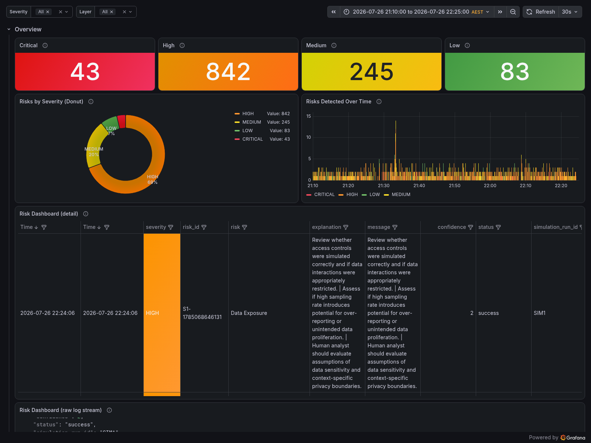
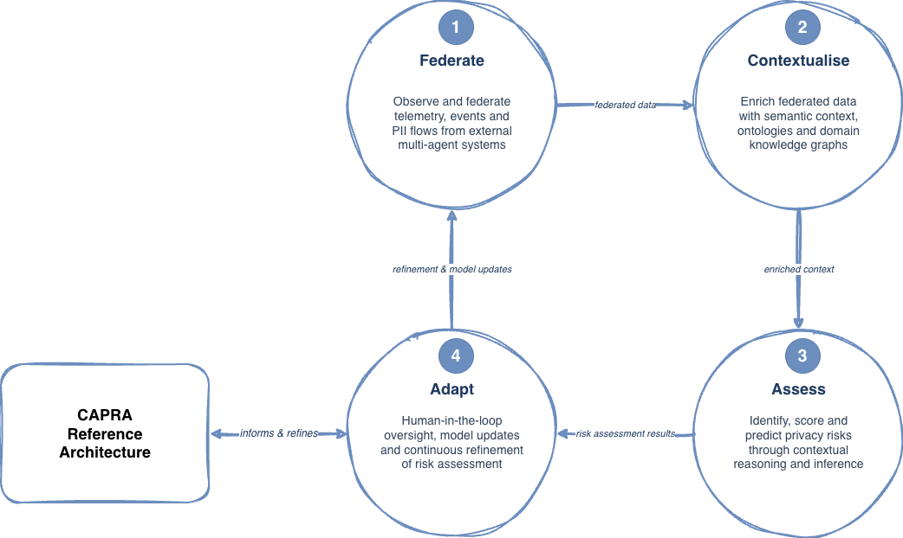

# CAPRA Prototype

**Context-Aware Privacy Risk Assessment (CAPRA)** is an executable n8n
prototype for examining privacy risks in multi-agent systems. It turns
generated agent telemetry into contextual assertions, bounded risk inferences,
refinement proposals, and a human-review step.

CAPRA processes multi-agent telemetry through six layers — **DFL** (Data Federation), **CPL** (Context Processing), **CL** (Context Layer, the shared knowledge substrate), **RIL** (Risk Intelligence), **FRL** (Feedback & Refinement), **HIL** (Human Interaction) — to surface data-privacy risks in agentic AI systems that handle personally identifiable information (PII).

The repository includes:

- a no-build Docker route for first-time users;
- deterministic synthetic fixtures for university admissions, healthcare, and
  retail;
- a five-stage CAPRA workflow and human-review form;
- local MongoDB, Fuseki, Loki, and Grafana services;
- scripts that configure, run, verify, and clean up the demonstration; and
- retained reports and evidence from earlier prototype campaigns.



*Historical risk-dashboard capture from the reference prototype. The reviewer
route provisions the same dashboard locally.*

> In the current prototype build, CL is materialised by the Apache Jena Fuseki
> ontology store that CPL reads and writes against, and FRL is the refinement
> portion of the Evaluation & Refinement Layer. Dashboard UIDs and Loki job
> names therefore retain the earlier prototype naming (`evalmain`,
> `evaluation_and_refinement_layer`).

> **Research prototype.** CAPRA is not production hardened. Its generated risk
> inferences are research outputs for inspection, not validated privacy
> assessments or automated compliance decisions.

---

## Table of contents

1. [Try CAPRA](#try-capra)
2. [Example instantiation: university admissions](#example-instantiation-university-admissions)
3. [Architecture at a glance](#architecture-at-a-glance)
4. [Repository layout](#repository-layout)
5. [Historical setup and evidence](#historical-setup-and-evidence)
6. [Grafana dashboards](#grafana-dashboards)
7. [Troubleshooting](#troubleshooting)
8. [Iteration status](#iteration-status)
9. [Related publications](#related-publications)
10. [Release and DOI](#release-and-doi)
11. [Citation and licence](#citation-and-licence)

---

## Try CAPRA

The reviewer route builds nothing from source. Docker starts n8n, MongoDB,
Fuseki, Loki, and Grafana, while one script configures the workflow and its
credentials.

### Requirements

- Docker Engine with Compose v2
- Python 3.9 or newer
- `curl`
- approximately 4 GB of free disk space and 6 GB allocated to Docker
- either an OpenAI-compatible endpoint, or
  [Ollama](https://ollama.com) for the local fallback

### 1. Clone and configure

```bash
git clone https://github.com/gracebilliris/capra-prototype.git
cd capra-prototype
cp reviewer/env.template reviewer/.env
```

The preferred route accepts any endpoint that implements the OpenAI
chat-completions API. Edit `reviewer/.env` and replace these placeholders:

```dotenv
CAPRA_LLM_PROVIDER=openai-compatible
OPENAI_COMPATIBLE_BASE_URL=https://replace.example/v1
OPENAI_COMPATIBLE_API_KEY=replace-with-your-key
OPENAI_COMPATIBLE_MODEL=replace-with-your-model-name
```

The file is git-ignored. The bootstrap imports the values into the local n8n
credential store, so no credential wiring is required in the n8n editor.

For a credential-free local fallback, set:

```dotenv
CAPRA_LLM_PROVIDER=ollama
CAPRA_OLLAMA_MODEL=llama3.2
```

The fallback is verified with `llama3.2` only. Local models vary substantially
in speed, instruction following, and structured-output reliability.

### 2. Start and verify the stack

Preferred endpoint route:

```bash
./reviewer/scripts/bootstrap.sh
./reviewer/scripts/verify_route.sh
```

Local Ollama fallback on macOS:

```bash
ollama serve &  # omit if Ollama already runs as a service
ollama pull llama3.2
./reviewer/scripts/bootstrap.sh --host-ollama
./reviewer/scripts/verify_route.sh
```

The verification script reports `ok`, `FAIL`, or `SKIP` for each service. A
`SKIP` is never counted as a pass. The interfaces are:

| Interface | URL | Purpose |
|---|---|---|
| n8n | <http://localhost:5679> | Inspect workflow branches and executions |
| Grafana | <http://localhost:3002/d/capra-risk-register> | Inspect privacy-risk outputs |
| Fuseki | <http://localhost:3031> | Inspect the shared Context Layer |
| Loki | <http://localhost:3101> | Query stage logs through Grafana |

### 3. Run an example

```bash
./reviewer/scripts/run_demo.sh --domain admissions --minutes 30
```

The command selects the synthetic university-admissions fixture, seeds twelve
generated agent events, activates the workflow for the requested observation
window, and records collection deltas, execution outcomes, and observed Loki
labels in:

```text
reviewer/logs/run_admissions_<provider>_<timestamp>.json
```

Use `healthcare` or `retail` to exercise another fixture. Endpoint and Ollama
runs are written to separate files and must be interpreted separately.

For the complete first-run instructions, expected checks, alternative Ollama
configuration, failure guidance, and clean-up commands, see
[`reviewer/QUICKSTART.md`](reviewer/QUICKSTART.md).

---

## Example instantiation: university admissions

The admissions fixture illustrates how the CAPRA framework is instantiated as
an executable assessment path. It contains twelve wholly synthetic applicant
records. The reviewer route's deterministic mock external-system seeder turns
these records into generated agent telemetry; CAPRA then processes that
telemetry through five executable stages over the shared Context Layer.



*CAPRA reference architecture lifecycle. The admissions prototype instantiates
this lifecycle as the five executable stages below over the shared Context
Layer.*

| Stage | Example responsibility | Inspectable output |
|---|---|---|
| Federate (DFL) | Normalise generated admissions-agent events | `telemetry_raw` records with canonical `event_id` values |
| Contextualise (CPL) | Add actor, purpose, data, and transmission context | contextual assertions and `prov:wasDerivedFrom` links |
| Assess (RIL) | Construct scenarios and produce bounded risk inferences | scenario, simulation, scoring, and `risk_inference_results` records |
| Refine (FRL) | Propose a change in response to an assessment | `evaluation_results` and `feedback_results` records |
| Review (HIL) | Present the proposal for Approve or Reject input | an n8n form submission that resumes the waiting execution |

A verified 30-minute run of the local `llama3.2` fallback produced records at
the federation, contextualisation, assessment, and refinement stages:

```json
{
  "telemetry_raw": 13,
  "enriched_telemetry_raw": 7,
  "raw_ontology": 5,
  "risk_inference_results": 8,
  "evaluation_results": 4,
  "feedback_results": 7,
  "revision_results": 0
}
```

These are collection deltas from one fallback observation window, not
benchmarks or reproductions of the paper's historical campaigns. The run did
not submit the human-review form. CAPRA has not established complete
same-event traversal, durable review-decision persistence, semantic
correctness, privacy effectiveness, or regulatory compliance.

The synthetic files and their schemas are documented in
[`reviewer/fixtures/README.md`](reviewer/fixtures/README.md).

---

## Architecture at a glance

```
                  Mock Telemetry Source (n8n workflow)
                              │
        ┌─────────────────────┴─────────────────────┐
        │                                           │
    [DFL] Data Federation Layer  ──►  MongoDB (telemetry_raw)
        │
    [CPL] Context Processing Layer  ──►  MongoDB (enriched_telemetry_raw)
        │                             ──►  [CL] Apache Jena Fuseki (ontology / SPARQL)
        │                                     ▲   │
        │                                     │   ▼  (context read by upper layers)
    [RIL] Risk Intelligence Layer  (5 agents: Scenario, Orchestrator, Sim1, Sim2, Inference)
        │                             ──►  MongoDB (risk_inference)
        │                             ──►  Grafana Loki (job=risk_intelligence_layer)
        │
    [FRL] Feedback & Refinement Layer  (implemented within the Evaluation & Refinement Layer)
        │                             ──►  MongoDB (evaluation_results)
        │                             ──►  Grafana Loki (job=evaluation_and_refinement_layer)
        │                             ──►  [CL] refinements written back to the ontology store
        │
    [HIL] Human Interaction Layer  (two-stage n8n form)  ──►  reviewer  ──►  FRL

  Observability: local Loki + Grafana on the reviewer route;
                 Grafana Cloud in the historical reference stack.
```

**Layer roles in one line each**

- **DFL** — normalises multi-source telemetry into a canonical event schema.
- **CPL** — enriches each event with contextual metadata read from CL.
- **CL** — the shared knowledge substrate (actors, resources, purposes, history); every other layer transacts through it, which also makes each assessment auditable.
- **RIL** — five-agent risk reasoning that scores each enriched event.
- **FRL** — detects systematic patterns in assessments and reviewer decisions, and writes targeted refinements back to CL.
- **HIL** — the sole channel for reviewer confirmation, correction, and annotation.

---

## Repository layout

| Path | Contents |
|---|---|
| `reviewer/` | No-build first-run route, synthetic fixtures, local service configuration, generated reviewer workflow, verification scripts, and detailed quick start. |
| `workflows/` | Published n8n workflow exports. `CAPRA_Prototype_unified_patched.json` is the source from which the reviewer workflow is derived; the other exports are retained for lineage. |
| `n8n_snippets/` | Code-node snippets used inside the workflow, including severity formatting and SPARQL sanitisation. |
| `dashboards/` | Version-controlled Grafana risk-dashboard definition and installation helper. |
| `dashboard_screenshots/` | Captures of each prototype layer, the aggregate view, and the risk dashboard. |
| `test_artefacts/` | Historical test plans, reports, findings, evidence mappings, and results matrices. |
| `evidence/` | Retained execution bundles and derived analysis outputs, each with its own scope and provenance record. |
| `docs/` | Historical reference-stack setup and supplementary documentation. |

---

## Historical setup and evidence

The route in [`docs/SETUP.md`](docs/SETUP.md) describes the reference stack
used for the earlier evidence campaigns. It is retained for provenance, but it
is **not the recommended first-run route and does not run as written**: it pins
an n8n version that predates workflow node versions, references unprovisioned
services, requires external credentials, and omits the original domain inputs.
Use `reviewer/` to try the current beta package.

The historical reproduction guide in
[`test_artefacts/20_Reproduction_Guide.md`](test_artefacts/20_Reproduction_Guide.md)
covers:

- Boot order (Fuseki → Mongo → n8n → dashboards)
- The three "always-success" metric-emitter fixes (CPL, HIL, FRL) — §6
- Rendering dashboards to PNG server-side (no browser needed) — §5.3, including the `capra-risk-register` render command
- Per-layer verification queries — §5.2
- Recovery procedures for the four documented infrastructure incidents — §4

The per-layer test reports (`test_artefacts/13`–`17`) contain the original
objectives, observations, and traceability records. The reviewer route uses new
synthetic fixtures and a reviewer-selected model, so its outputs do not
reproduce the historical campaign numbers.

---

## Grafana dashboards

| UID | Slug | Purpose | Figure |
|---|---|---|---|
| `dflmain` | `data-federation-layer` | DFL health | Fig 5.1 |
| `cplmain` | `context-processing-layer` | CPL health | Fig 5.2 |
| `grpt7hn` | `risk-intelligence-layer` | RIL health | Fig 5.3 |
| `evalmain` | `evaluation-layer` | FRL health (Evaluation & Refinement) | Fig 5.4 |
| `hilmain` | `human-interaction-layer` | HIL health | Fig 5.5 |
| `alllayers` | `all-layers-e28094-overview` | Combined | Fig 5.6 |
| `capra-risk-register` | `capra-e28094-risk-dashboard` | Substantive risk output (severity, explanation, risk name) | **Fig 5.7** |

The last dashboard's JSON is version-controlled in `dashboards/risk_register.json`. All queries include `| json | risk != ""` so RIL heartbeats (`status="skipped"`) are hidden.

---

## Troubleshooting

For the reviewer route, start with the complete failure table in
[`reviewer/QUICKSTART.md`](reviewer/QUICKSTART.md#failure-guidance). Common
first-run issues are:

| Symptom | Likely cause | Action |
|---|---|---|
| Bootstrap stops before starting services | Endpoint placeholders remain in `reviewer/.env` | Supply the three endpoint values, use `--configure-only`, or select the Ollama fallback |
| Endpoint verification reports `FAIL` | The base URL, key, network path, or `/models` support is incorrect | Recheck the endpoint documentation; if `/models` is unsupported, use the first agent execution as the live test |
| A default port is already allocated | Another local service uses that port | Change the corresponding `CAPRA_*_PORT` value in `reviewer/.env` and rerun the bootstrap |
| Risk-dashboard panels remain empty | No stage logs have reached Loki in the selected window | Confirm `verify_route.sh` reports Loki `ok`, then run a longer observation window |
| Agent output cannot be parsed | The selected model did not return the requested structured JSON | Use a stronger structured-output model; this is common with small local models |

The following diagnostics apply to the retained historical reference stack:

| Symptom | Root cause | Fix |
|---|---|---|
| RIL executions error with `Connect to localhost:3030 refused` | Fuseki container down | `docker start context-processing-layer-prototype-fuseki-1` |
| RIL executions error with `you are over your space quota, using 512 MB` | MongoDB Atlas free tier full | Delete old collections in Atlas or upgrade tier — see `docs/SETUP.md` §7 |
| Dashboard shows only CRITICAL and LOW, no HIGH/MEDIUM | Old stale data from before the integer-severity patch | Narrow time range to post-patch, or clear the `risk_intelligence_layer` Loki stream |
| Dashboard shows `domain=unknown` for all rows | CPL prompt does not propagate a `domain` label to RIL | Use time-window filtering per domain (documented behaviour — see `15_Layer_Report_RIL.md §12`) |
| Workflow "active=1" in DB but doesn't fire | n8n reads active state from `workflow_history`, not `workflow_entity` | Restart the n8n container after any DB edit (`docker restart context-processing-layer-prototype-n8n-1`) |

More historical diagnostics are recorded in
`test_artefacts/07_Test_Run_Findings.md`.

---

## Iteration status

| Iteration | Status | Reference |
|---|---|---|
| Alpha | Demonstrated end-to-end across three illustrative scenarios | `test_artefacts/13`–`17_Layer_Report_*.md` |
| Beta  | All prototype layers ≥ 95% per-layer reliability (combined 98.53%); substantive risk output surfaced in Risk Dashboard (30% CRIT / 49% HIGH / 15% MED / 6% LOW over the reference window) | `test_artefacts/18_AllLayers_Combined_Report.md`, `test_artefacts/07_Test_Run_Findings.md §20` |
| Gamma (in progress) | Pending; will incorporate industry field survey results | — |

**Latest tagged release:** [`v1.0-icse-demo`](https://github.com/gracebilliris/capra-prototype/releases/tag/v1.0-icse-demo) (commit `022d22d`) — pinned prototype snapshot referenced by the CAPRA publications programme.

---

## Related publications

Published peer-reviewed and preprint outputs that motivate, ground, or extend the CAPRA prototype in this repository.

> **Featured publication:** Billiris, G., & Gill, A. (2026). *A Federated Observability Architecture Pattern for Reliable Agentic AI Software Systems Across the AI Software Development Lifecycle.* *Information and Software Technology, 199*, Article 108260. Published in an A-ranked journal. [Read the paper](https://doi.org/10.1016/j.infsof.2026.108260) or [view the prototype](https://github.com/gracebilliris/federated-observability-architecture-pattern).

1. Billiris, G., & Gill, A. (2026). *A Federated Observability Architecture Pattern for Reliable Agentic AI Software Systems Across the AI Software Development Lifecycle.* *Information and Software Technology, 199*, Article 108260. https://doi.org/10.1016/j.infsof.2026.108260
2. Billiris, G., Gill, A., Haggag, O., Bandara, M., & Grundy, J. (2026). *CPL: A Context Processing Layer for Semantic Observability in Multi-Agent AI Systems.* SSRN 7194446. https://doi.org/10.2139/ssrn.7194446
3. Billiris, G., Gill, A., & Bandara, M. (2026). *Systematic Literature Review of Data Privacy Risks in AI Systems.* *Science and Information Computing Conference (SAI) 2026*. https://link.springer.com/book/10.1007/978-3-032-24810-7
4. Billiris, G., Gill, A., & Bandara, M. (2025). *Privacy in the Age of AI: A Taxonomy of Data Risks.* arXiv. https://doi.org/10.48550/arXiv.2510.02357
5. Billiris, G., Gill, A., & Bandara, M. (2025). *A Taxonomy of Data Risks in AI and Quantum Computing (QAI): A Systematic Review.* arXiv. https://doi.org/10.48550/arXiv.2509.20418
6. Billiris, G., Gill, A., Oppermann, I., & Niazi, M. (2024). *Towards the Development of a Copyright Risk Checker Tool for Generative Artificial Intelligence Systems.* *Digital Government: Research and Practice, 5*(4), Article 41. https://doi.org/10.1145/3703459
7. Billiris, G., & Gill, A. Q. (2024). *An Initial Review of the Copyright Concerns of Generative Artificial Intelligence.* *ACIS 2024 Proceedings*, Article 17. https://aisel.aisnet.org/acis2024/17/

---

## Release and DOI

- **Reviewer-facing release:** [`v1.0-icse-demo`](https://github.com/gracebilliris/capra-prototype/releases/tag/v1.0-icse-demo) — the pinned snapshot used by the ICSE 2027 Tool Demonstration submission and by every venue listed above that cites the prototype.
- **Zenodo DOI:** *pending mint.* The repository is registered with Zenodo via the GitHub webhook; the DOI will be embedded here once the release is published on Zenodo.
- **Authorship and CRediT roles:** see [`AUTHORS.md`](AUTHORS.md).
- **Machine-readable citation:** see [`CITATION.cff`](CITATION.cff).
- **Release verification and archive:** see [`RELEASE_CHECKLIST.md`](RELEASE_CHECKLIST.md) and `scripts/verify_release.sh`.

---

## Citation and licence

If you refer to this prototype, please cite the CA3 candidature report:

> Billiris, G. (2026). *Privacy Protection for Agentic AI Systems Processing Personally Identifiable Information* — Candidature Assessment 3 Report, University of Technology Sydney.

This work is released for academic examination. Contact the author (@gracebilliris on GitHub) for other uses.
